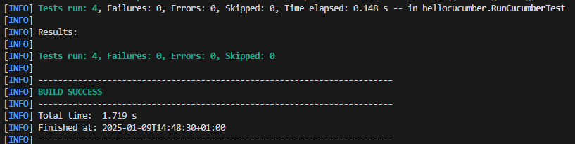
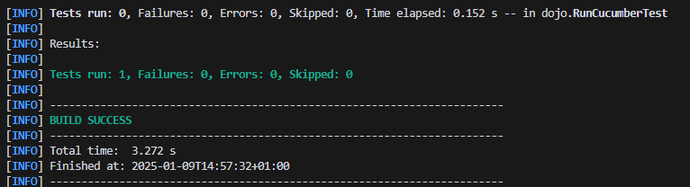

= TP1 

== Fichiers

[source,gherkin]
----
Feature: Is it Friday yet?
  Everybody wants to know when it's Friday

  Scenario Outline: Today is or is not Friday
    Given today is "<day>"
    When I ask whether it's Friday yet
    Then I should be told "<answer>"

    Examples:
      | day            | answer |
      | Friday         | TGIF   |
      | Sunday         | Nope   |
      | anything else! | Nope   |
----

== Test Execution Results

= TP2

== Order.java Content

----

package dojo;

import java.util.ArrayList;
import java.util.List;

public class Order {
    private String owner;
    private String target;
    private List<String> cocktails;
    private String message;

    public Order() {
        this.cocktails = new ArrayList<>();
    }

    public void declareOwner(String owner) {
        this.owner = owner;
    }

    public void declareTarget(String target) {
        this.target = target;
    }

    public List<String> getCocktails() {
        return cocktails;
    }

    public void addMessage(String message) {
        this.message = message;
    }

    public String getTicketMessage() {
        return String.format("From %s to %s: %s", owner, target, message);
    }
} 

----

== Test Results

