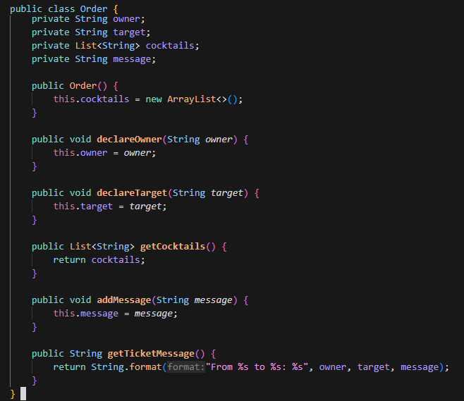

= TP1 

== Fichiers

[source,gherkin]
----
Feature: Is it Friday yet?
  Everybody wants to know when it's Friday

  Scenario Outline: Today is or is not Friday
    Given today is "<day>"
    When I ask whether it's Friday yet
    Then I should be told "<answer>"

    Examples:
      | day            | answer |
      | Friday         | TGIF   |
      | Sunday         | Nope   |
      | anything else! | Nope   |
----

== Test Execution Results

image::test-results.png[]
----

= TP2

== Order.java Content

== Test Results

image::test-results2.png[Test Results TP2]